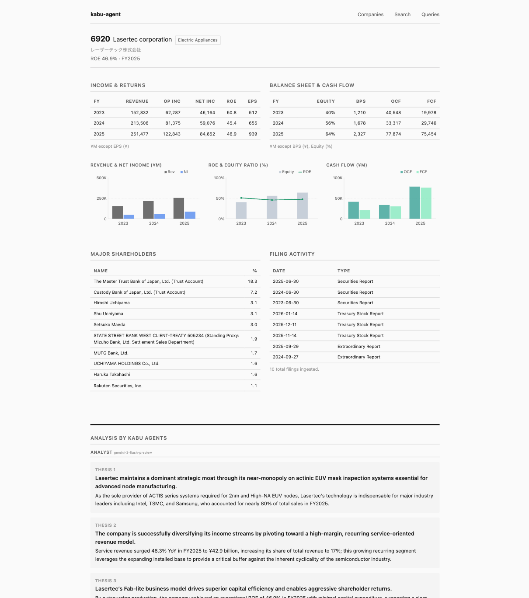

# kabu-agent
### 株エージェント

From EDINET filing to investment thesis.

An agentic research pattern for Japanese equities.



Ingests regulatory filings, extracts financials and shareholders, screens for quality indicators, then runs competing agents that produce investment theses from opposing perspectives.

[EDINET](https://disclosure.edinet-fsa.go.jp/) is Japan's regulatory filing system — the SEC EDGAR equivalent.

## Browse — no keys needed

    pip install -r requirements.txt
    cp .env.example .env
    flask run

50 companies with financials, shareholders, and screening queries pre-loaded.
A few have pre-computed agent analyses so you can see the full output without configuring any API keys.

## Ingest — add EDINET API key

    python pipeline.py 6758                    # securities report
    python pipeline.py 6758 --doc-type 180     # material events
    python pipeline.py 6758 --doc-type 220     # buyback activity
    python seed.py --rebuild-index             # refresh filing index

Any of 3,800+ listed companies.  Each doc type adds data to the company factsheet.

## Analyze — add LLM keys

    python analyze.py 7203

Analyst builds 2-3 investment theses with supporting evidence.
Skeptic challenges each thesis with specific counter-arguments.
Outlook weighs both sides.  Analysis appears on the company page.

Different models for different roles. The Analyst is cheap and fast. The Skeptic needs to push back — it costs more.

## Architecture

```
Entity Search (offline, 3,800+ companies)
     ↓
Filing Index (seed.py caches all filing metadata)
     ↓
Filing Ingestion (fetch_and_parse by doc ID → SQLite)
  Doc 120: financials + shareholders
  Doc 180: material events
  Doc 220: buyback activity
     ↓
Screening Queries (SQL against local data)
     ↓
Multi-Agent Analysis
  Analyst (Gemini Flash) → Skeptic (Sonnet) → Outlook (Flash)
  7 tools: typed queries + web search
```

App runs locally.  The database is SQLite.  Add companies, doc types, screening queries, or agent tools.

## Design notes

- **Model selection per role.** Cheap models summarize well but don't push back.  A sub $0.01 Skeptic agent agrees with too much.  Start cheap, measure quality, upgrade bottlenecks as needed.

- **Tool naming steers behavior.** Short obvious names for tools you want agents to use. Long ugly names for tools you want them to avoid.  Measured 30% → 99% typed tool adoption after renaming.

- **Schema context reduces hallucination.** Putting schema docs in the system prompt cuts SQL hallucination by ~40%, but models still invent columns from similar tables.  Pre-built typed query tools solve this better than prompt engineering.

- **Web search in Japanese.** Returns 10x better results for Japanese companies.  Put language guidance in tool docstrings, models follow reliably.

- **Single runs are unreliable for ranking.** Same prompt, different top outlook each run.  Use screening queries as an initial candidate shortlist.  Human judgment still makes the key decisions.

## Beyond this repo

The production system runs daily across 400K+ filings and 3,800 listed companies. I use it to make investment decisions. This repo demonstrates one pattern for agentic research on Japanese equities.

Built on [edinet-tools](https://github.com/matthelmer/edinet-tools) and Simon Willison's [llm](https://github.com/simonw/llm).

---

Matt Helmer · data@japanfinsight.com
